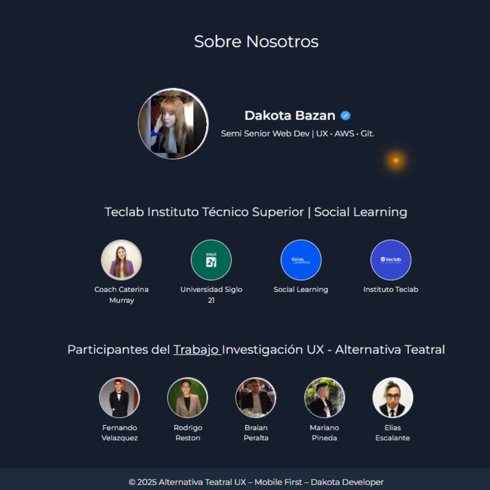

# Proyecto UX – Alternativa Teatral – Mobile First

**Desarrollador:** Dakota B.  
**Nivel:** Semi Senior – Desarrollo avanzado en UX  

---

## 🎯 Descripción

Rediseño de la experiencia de usuario de Alternativa Teatral, basado en investigación y desarrollo previo.  
El objetivo: **interfaz intuitiva, navegación fluida y máxima comodidad para el usuario**, superando las limitaciones de la página oficial [alternativateatral.com](https://www.alternativateatral.com/).

---

## 🛠 Tecnologías & Herramientas

HTML5 | CSS3 | SASS (Syntactically Awesome Stylesheets; Preprocesador CSS que extiende las capacidades del mismo, permitiendo escribir estilos de forma más eficiente, modular y mantenible) | JavaScript | SEO & Performance  

---

## 🚀 Funcionalidades Clave

- Navegación clara y responsive  
- Formularios con validación en tiempo real  
- Galería de obras y talleres comodos
- Optimización de accesibilidad y rendimiento  

---

## 📊 Investigación UX

Informe completo disponible aquí:  
[Informe UX API 2 – Teclab PDF](https://github.com/DakotaB75/Teclab_Tecnicatura_Sup_Programacion_Tareas/blob/d02f06ba516fdea5c80f29fe70e9c6fca4e7c6fc/Teclab%20-%20Tecnicatura%20Sup.%20en%20Programacion/experiencia%20de%20usuarios%20-%20Tareas/EXP%20Usuario%20API%202%20-%20Teclab.pdf)

---

## 🌟 Resultados & Impacto

- Experiencia de navegación mejorada y optimizada  
- Diseño mobile-first y accesible  
- Prototipos y métricas UX para iteraciones futuras  

---

## 🤝🏻 Agradecimientos

Gracias por su colaboración al proyecto **UX Research** 💜  
[Reel UX Research](https://www.instagram.com/reel/DLvpty8JyJ3/?igsh=NHV0OXJjMDh6NXdi)  

#UXResearch #TrabajoEnEquipo #MujerEnTech #ProyectoIT #CrecimientoProfesional #InvestigacionUX

